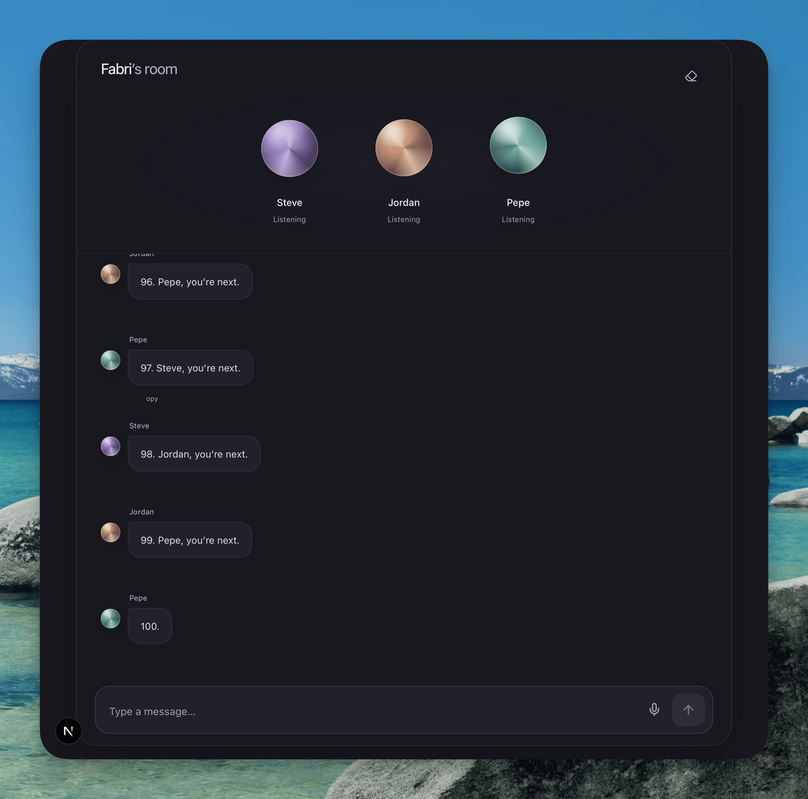

# Three agents counting to 100

<p align="center">
  
</p>

There is a [short](https://www.youtube.com/shorts/FOKAYc5u5ws) of a guy with
three phones, each running a voice assistant, asking them to count to 100. They
all say "one" at the same time and never get past it.

This is the same room with three agents that take turns. Nobody tells them
whose turn it is. Each one reads the whole transcript, decides whether the last
line was meant for it, and either answers out loud or stays quiet.

```
> Hey Steve, Jordan, Pepe. Count up to 100. Steve, you start, and after your
  number ping the next one. Don't mention me, this is only between the three of you.
  Steve:  One. Jordan, you’re next.
  Jordan: Two. Pepe, you’re next.
  Pepe:   Three. Steve, you’re next.
  ...
  Pepe:   Ninety-nine. Steve, you’re next.
  Steve:  One hundred. We’re done!
```

Voice is ElevenLabs `eleven_flash_v2_5`, the microphone is `scribe_v2_realtime`,
the UI is ElevenLabs UI on shadcn. The agents are three
[Hermes](https://github.com/NousResearch/hermes-agent) processes.

## The shape

```mermaid
flowchart LR
  mic["🎙 press to record, then send"] -->|scribe_v2_realtime| say
  type["⌨ type"] --> say["POST /api/say"]

  say --> steve["Steve"]
  say --> jordan["Jordan"]
  say --> pepe["Pepe"]

  steve --> gate{"was this<br/>for me?"}
  jordan --> gate
  pepe --> gate

  gate -->|no| quiet["silence"]
  gate -->|yes| reply["reply, whole"]

  reply -->|"GET /api/speak<br/>with-timestamps"| room["transcript<br/>follows the voice"]

  reply -.->|becomes a line<br/>the others read| say
```



The dotted edge is what makes it a room: an agent's reply re-enters as a line
with its name on it, like a person's, and the round ends when nobody thought
the last thing said was for them.

Two rules carry the turn-taking. A turn that ends in nothing is a success, not
an error. And whether a line is for you is a function over the transcript, not
a prompt. The agents are upstream Hermes through its plugin interfaces: three
hooks and one middleware, no fork. `SETUP.md` has the long version.

```
20:07:13 [llm]     round=1 gpt-5.6-sol in=310 (cache_r=26,112 hit=99%) out=81 stop 3.2s
20:07:16 [policy]  quiet   reason='suppress token' raw=8 → 0
```

## ElevenLabs

Everything below came off this project's own free-plan key.

**Voice.** `textToSpeech.convertWithTimestamps` with `eleven_flash_v2_5`. Same
voice, same sentence: flash 0.7s, `eleven_multilingual_v2` 1.2s, `eleven_v3`
2.7s. Synthesis is not in the agent's turn: the reply text lands first and the
browser asks for the audio after, which put the text on screen two seconds
sooner. The timestamps are what let the transcript follow the voice through the
line. `mp3_44100_64` because the clip travels as base64 inside JSON, and
`previousText` carries the line being answered so a reply sounds like an
answer. Clips are cached by the hash of everything that decides them.

**Microphone.** `Scribe.connect` from `@elevenlabs/client`, `scribe_v2_realtime`,
manual commit, `filterBackgroundAudio`. The key never reaches the browser:
`/api/scribe` mints a single-use token for one session. Press to speak, not
open mic: the agents talk out loud and the microphone hears them through the
speaker, so an open mic would send their own words back to all three.

**Voices.** Ten premade voices, picked on `high_quality_base_model_ids`, how
many current model families render them. Nothing under 7 is in the list. Adam,
who led the account list for months, sits at 0, which is why he sounded flat.
The list is `speech.json`, read by both the Python and the browser.

**UI.** `Conversation`, `Message` and `Response` from the ElevenLabs UI
registry. The orbs are CSS now: the WebGL `Orb` suspended on a CDN texture
fetch and the browser reclaimed its context under load.

Two things found in the SDKs on the way:

- [elevenlabs/ui#82](https://github.com/elevenlabs/ui/issues/82): the registry's
  realtime transcriber shipped `modelId: "scribe_realtime_v2"`. The socket
  opens, then the server closes it with `invalid_request`, so it reads as a
  broken microphone. Fixed in [#83](https://github.com/elevenlabs/ui/pull/83).
- `@elevenlabs/client` has 23 realtime events and none of them fires when audio
  starts flowing. `session_started` means the server accepted the session, not
  that the browser is sending anything. This room wraps the connection's `send`
  to notice the first chunk before it calls itself listening. An `onAudioData`
  callback on `Scribe.connect` would remove that patch.

Evaluated and not taken: `text-to-dialogue` (first sound goes from +0.0s to
+15s, because a dialogue needs every reply before it can start), streaming the
model (469 turns ended in a suppress token, so streaming shows text from an
agent that then says nothing), and the Agents platform, which is one agent
with one voice and one turn-taking policy. The subject here is what happens
with three, none of them told whose turn it is.

## Running it

One container holds the three agents and the room in front of them. Two keys
and a port:

```sh
docker build -t count-to-100 .
docker run -p 3000:3000 \
  -e OPENROUTER_API_KEY=... \
  -e ELEVENLABS_API_KEY=... \
  -v count-to-100:/data \
  count-to-100
```

Open `localhost:3000`, give your name, paste the prompt at the top and say
nothing else. The volume keeps the agents' memory and history across rebuilds.

A key behind a public link can spend real money, so the room counts:
`SPEECH_MONTHLY_CHARACTERS` (200,000) and `SPEECH_MONTHLY_SESSIONS` (300) are a
month's allowance, past which it keeps working in text. `SPEECH_ENABLED=0`
takes the voice off without touching the key.

To work on it, the pieces run apart so each restarts on its own:

```sh
pnpm setup                             # writes .hermes/ with a config and a key
# add OPENROUTER_API_KEY + ELEVENLABS_API_KEY to .hermes/.env
pnpm start                             # the runtime
uv run python scripts/group_up.py      # Steve, Jordan, Pepe
pnpm web                               # the room
```

`pnpm status` says what is missing. 242 Python tests, 158 web unit tests and 32
in the browser; lint, types, all suites and a production build run on every
PR. `QA.md` is the manual pass. The web side has its own
[README](web/README.md) and [developer guide](web/docs/developer-guide.md).
